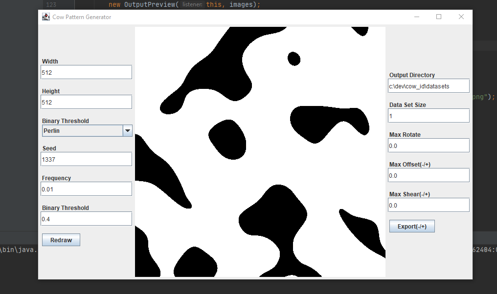
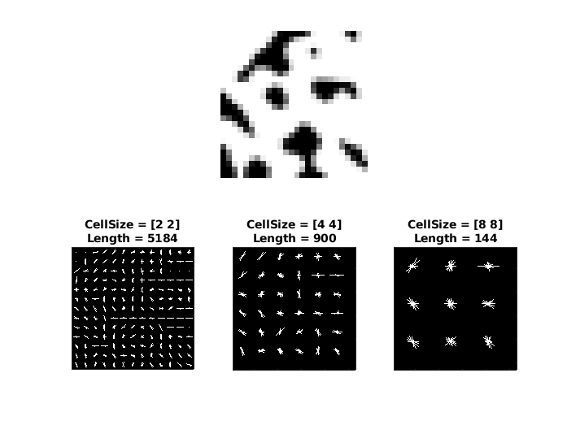
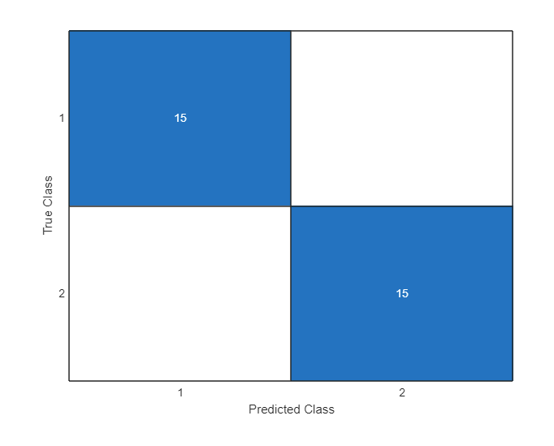

# Description
With the KuhR-Code Generator I created 2 different noise patterns. As seen in the images, the patterns are very distinct. Based on these patterns, I exported 2 data set with 50 images each where each one was slightly transformed at random to simulate different viewing angles. I fed these data sets to a MATLAB program, that used the HOG feature extraction method and a SVM classifier. The sets were divided into training and test data sets where 70% of the data went into the training set and 30% into the test set.

# Results
Due to the simplicity of the tests the identification accuracy was 100%. This is in no way representative of how well the chosen algothrims work. Though some valuable information was gained. Firstly, the original image size of 512x512 pixel is too much for the algorithms. The temporary solution was to down-scale the image in MATLAB to 10% of the original size. This resulted in long processing times, so for the future a size of 128x128 pixel will be used. Secondly, based on this simplistic experiment 50 images per "simulated cow" produced good results, but for the future varying sizes of data sets need to be tested.

# Images

