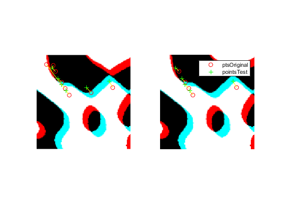
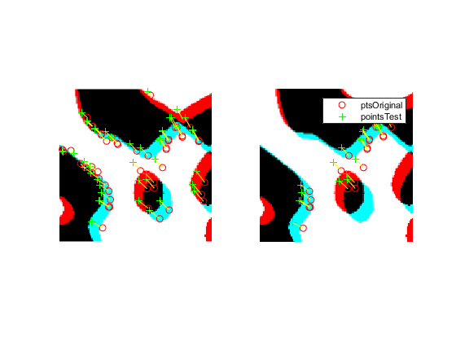

# MATLAB Functions

## Feature Detection and Extraction

https://uk.mathworks.com/help/vision/ug/local-feature-detection-and-extraction.html

Local features within images are patterns or distinct structures such as points, edges or images patches. These features differ from their immediate surroundings by texture, color or intensity but they hold no information as to what they represent. Local features are mainly used either for image stiching or as means of compact representation.

Good features include edges, __blobs__ and regions. They have these properties:
- Repeatable detections
- Distinctive
- Localizable

__Detection__: finding unique patterns in images for further processing

__Extraction__: computing a descriptor on a region around the detected feature, often represented by compact vector 

## Classification vs Registration
Image registration transforms images form different measurements (such as sensore, viewing angles, ...) into one coordinate system, to make the data comparable. ORB, BRISK, FREAK are binary descriptors, which are mainly used for image registration.

Image classification uses local features (pixel information) to classify images. HOG, SURF, KAZE descriptors are suitable for classification.

Based on that, focus for now should be on HOG, SURF, KAZE.

## Detection Funtions

### SURF
- Speeded Up Robust Features
- blob detector
- scale- and rotation invariant interest point detector and descriptor
- slightly faster U-SURF which is not invariant to image rotation

Testing of SURF feature detection and descriptor functions: 

### KAZE
- blob detector
- uses non linear scale space to reduce noise 
- scale- and rotation invariant point detector and descriptor
- does not do downsampling per octave (probably computationally intensive)

Testing of KAZE feature detection and descriptor functions: 

### FAST
- Feature from Accelerated Segment Test
- corner detector
- high performance (speed)
- considers 16 pixel around the corner candidate p
- if n contiguous pixels in circle brighter (or darker) than p, p classifies as corner
- in machine learning works slightly differently
  - walks through all pixels in a given image and tests circle of 16 pixel around it
  - partitions pixels into sets of darker, similar, brighter pixels
  - selects the pixels which yield the most information
  - (UNDERSTAND) some entropy function runs and creats a decision tree
  - decision tree is not exactly the same as segment test algorithm, but only very slightly different.
- pros:
  - many times faster than most corner detectors
  - repeatablitlity under large aspect changes
- cons:
  - not robust to high levels of noise
  - may respond to 1 pixel wide lines, when quantization of circle misses the line
  - dependent on a threshold 

## Descriptor Functions

### SURF
### KAZE
### HOG